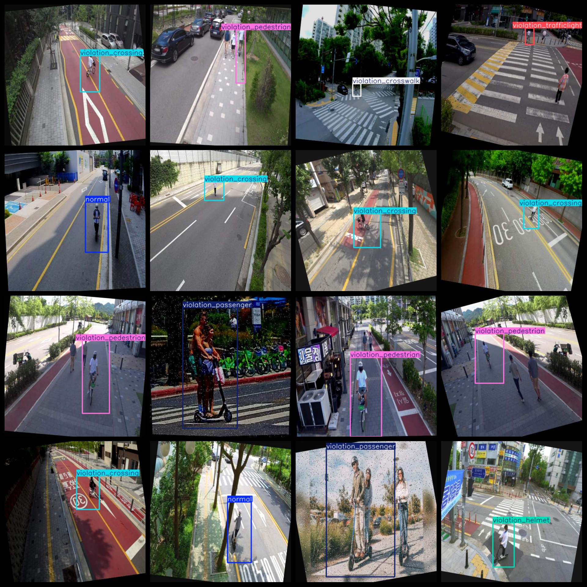
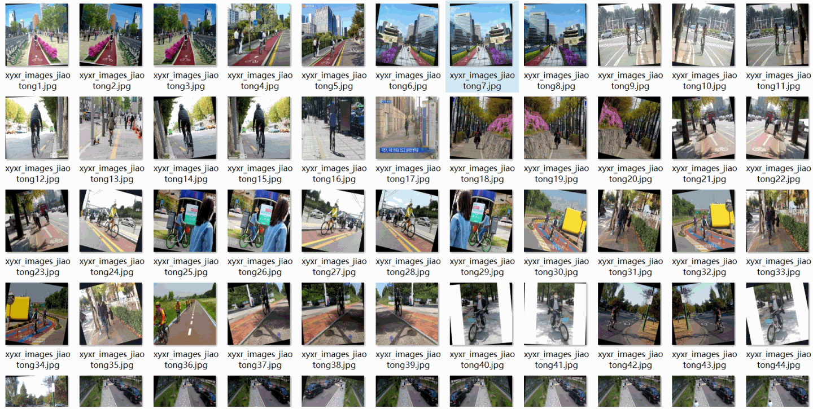

# [Object Detection] Traffic Violations Detection Dataset

This dataset consists of 5056 images in the format of VOC and YOLO, along with their respective annotations. The dataset is organized into three folders: JPEGImages, Annotations, and labels.

The JPEGImages folder contains a total of 5056 JPEG images. The Annotations folder includes a total of 5056 XML files, while the labels folder contains a total of 5056 txt files.

The dataset has 7 label categories: ["normal", "violation_crossing", "violation_crosswalk", "violation_helmet", "violation_passenger", "violation_pedestrian", "violation_trafficlight"]. Each category has its own number of frames (the yolo format does not follow this order, but rather the classes.txt file in the labels folder).

- normal: 641 frames
- violation_crossing: 896 frames
- violation_crosswalk: 1056 frames
- violation_helmet: 486 frames
- violation_passenger: 589 frames
- violation_pedestrian: 1389 frames
- violation_trafficlight: 278 frames

Total frame count: 5335

All images are of high resolution clarity. The images have been enhanced for training purposes. The shape of the labels is a rectangle, which is used for object detection recognition.

Special Notes: This dataset does not guarantee the accuracy or efficiency of any trained models or weight files. It only provides accurate and reasonable annotations.

Annotation Example:

## Images

---

Here is a pay link on Stripe (https://buy.stripe.com/3cs8yP7sY87d0vu9AB). Please contact me lonlonago@foxmail.com after funding $89, and I will send you a complete data files, thank you!

